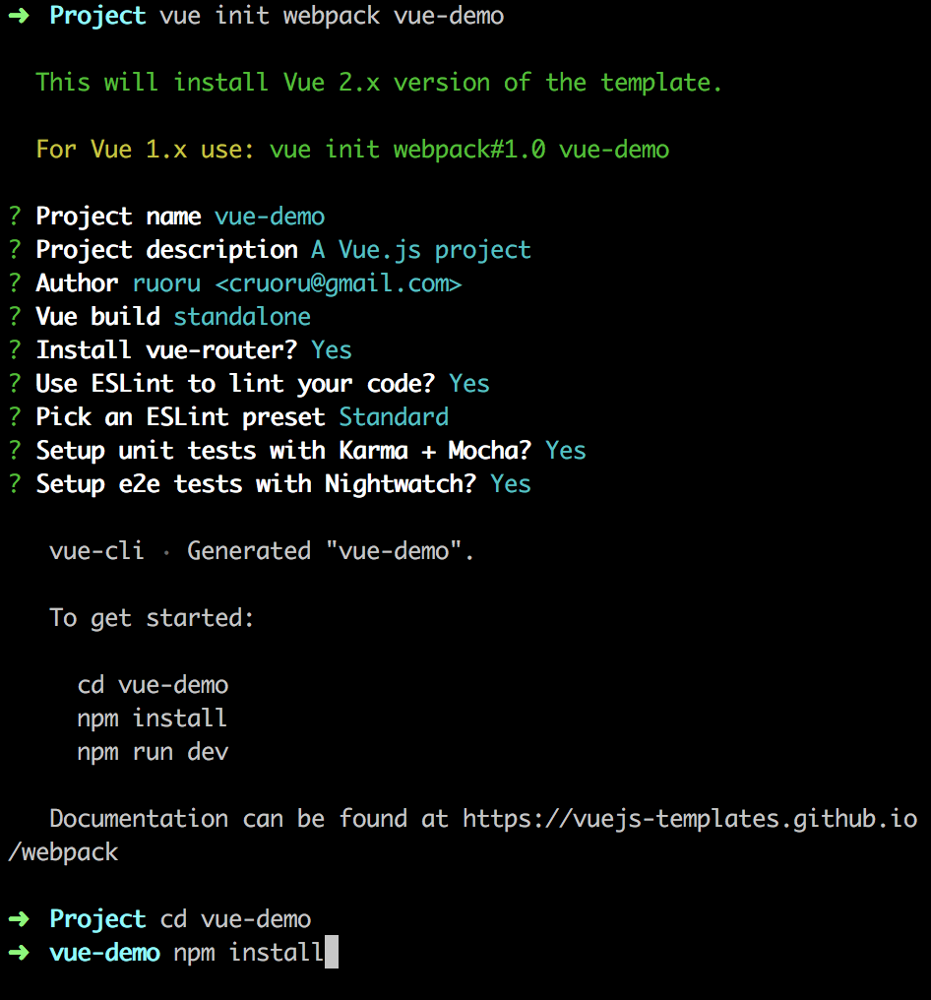

# vue-demo

> vue demo

## Build Setup

``` bash
# install dependencies
npm install

# serve with hot reload at localhost:8080
npm run dev

# build for production with minification
npm run build

# build for production and view the bundle analyzer report
npm run build --report

# run unit tests
npm run unit

# run e2e tests
npm run e2e

# run all tests
npm test
```

For detailed explanation on how things work, checkout the [guide](http://vuejs-templates.github.io/webpack/) and [docs for vue-loader](http://vuejs.github.io/vue-loader).

## Start
环境
``` bash
macOS Sierra v10.12
node v6.9.5
npm v3.10.10
vue v2.8.1
```

[vue 官方网站](https://vuejs.org/)
[vue 中文文档](https://cn.vuejs.org/v2/guide/)

1. 安装node
2. 安装npm。若是没有vpn，可以使用以下命令安装cnpm命令，使用淘宝镜像。
``` shell
sudo npm install -g cnpm --registry=https://registry.npm.taobao.org
```
3. 安装vue
``` shell
sudo npm install --global vue-cli
```
4. 执行过程
